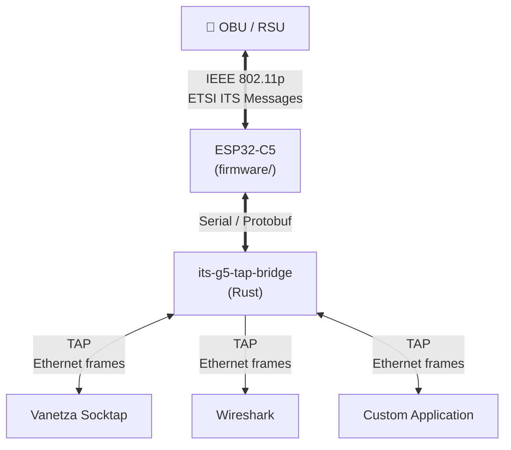

# esp32-its-tap

> [!CAUTION]
> **5.9 GHz ITS spectrum is safety-critical. Transmitting may require a license.**
>
> Unauthorised transmission can interfere with real-world transportation systems and may be illegal in your country.
> In no event shall the authors or copyright holders be liable for any claim, damages or other liability arising from the use of this software.
>
> **Check local regulations. Use at your own risk.**

A low-cost **IEEE 802.11p (ITS-G5) transceiver** built on the **ESP32-C5** (Seeed Studio XIAO ESP32C5).
It transmits and receives raw 802.11p frames on **channel 180 (5.9 GHz)** using undocumented Espressif PHY
functions and a reverse-engineered internal Wi-Fi TX/RX path.

The firmware communicates with a host PC over USB serial using a compact **Protocol Buffer** protocol.
A companion **Rust tap bridge** exposes a standard [TAP network interface](https://en.wikipedia.org/wiki/TUN/TAP), enabling integration with
[Wireshark](https://www.wireshark.org/), [Vanetza](https://www.vanetza.org/), and custom V2X applications.

## Credits

This project is a fork of [**TheEnbyperor/esp32-c-its**](https://github.com/TheEnbyperor/esp32-c-its).
The reverse-engineering of the internal Wi-Fi TX/RX path, buffer structures, and undocumented function calls
was performed by [TheEnbyperor](https://github.com/TheEnbyperor).

## Architecture



## Prerequisites

| Component            | Requirement                                        |
|----------------------|----------------------------------------------------|
| **Hardware**         | [Seeed Studio XIAO ESP32C5](https://www.seeedstudio.com/Seeed-Studio-XIAO-ESP32C5-p-6609.html) + iPEX connector antenna for 5.9 GHz |
| **Firmware build**   | [PlatformIO](https://platformio.org/)              |
| **Tap bridge**       | [Rust toolchain (stable)](https://rust-lang.org/tools/install/)|
| **Python client**    | Python ≥3.10, [uv](https://docs.astral.sh/uv/)     |

> Porting to other ESP32-C5 boards should be straightforward, adjust `platformio.ini` and provide a matching `sdkconfig`.

## Quick Start

### 1. Flash the firmware

```bash
cd firmware
pio run --target upload --environment main
```

The firmware starts transmitting and receiving immediately after boot. A heartbeat message (with MAC address,
uptime, TX/RX counters, and free heap) is sent every 10 seconds.

### 2. Run the tap bridge

```bash
cd its-g5-tap-bridge
sudo -E env PATH="$HOME/.cargo/bin:$PATH" cargo run -- --serial /dev/ttyACM0
```

This creates a TAP interface named `its-g5-tap`. All received 802.11p frames are converted to Ethernet and
written to the TAP; Ethernet frames written to the TAP are converted to 802.11p and transmitted.

### 3. Capture with Wireshark

```bash
sudo wireshark -k -i its-g5-tap
```

### 4. Integrate with Vanetza

```bash
sudo ./socktap -i its-g5-tap
```

See [socktap](https://www.vanetza.org/tools/socktap/).

## Python Test Client

The Python client in `testing/` talks directly to the board over serial, bypassing the tap bridge.
Useful for debugging, capturing, and replay.

```bash
cd testing

# Capture received frames to a pcapng file (Ctrl+C to stop)
uv run python -m client --port /dev/ttyACM0 --pcap captures.pcapng

# Replay ITS payloads from a pcapng file
uv run python -m client --port /dev/ttyACM0 --send-pcap toTransmit.pcapng
```

## Interoperability

Tested between ESP32-C5 and real IEEE 802.11p (ITS-G5) hardware:

| Receiver →<br/>Transmitter ↓ | ESP32-C5 | Real 802.11p Hardware                     |
|------------------------------|----------|--------------------------------------------|
| **ESP32-C5**                 | ✅ Works | ⚠️ Works, occasional frame loss            |
| **Real 802.11p Hardware**    | ✅ Works | ✅ Known working                           |

## Serial Protocol

Communication between the ESP32-C5 and the host uses a simple framed protobuf protocol over USB serial
(115200 baud). Each message is prefixed with a 2-byte magic (`0xBEEF`) and a 2-byte length field.

See [`interface/interface.proto`](interface/interface.proto) for the full schema.
